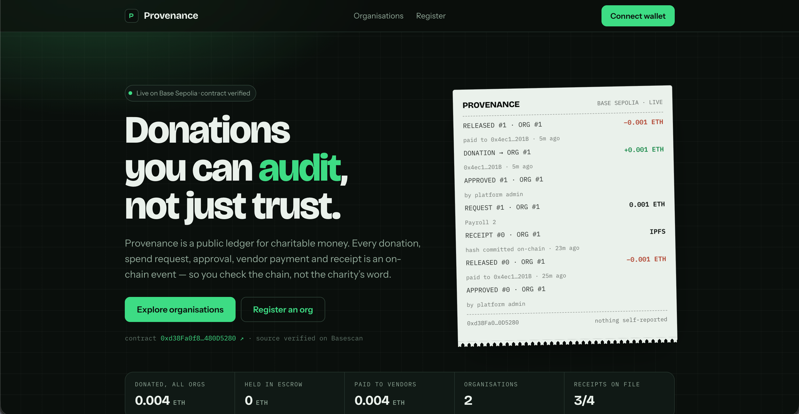
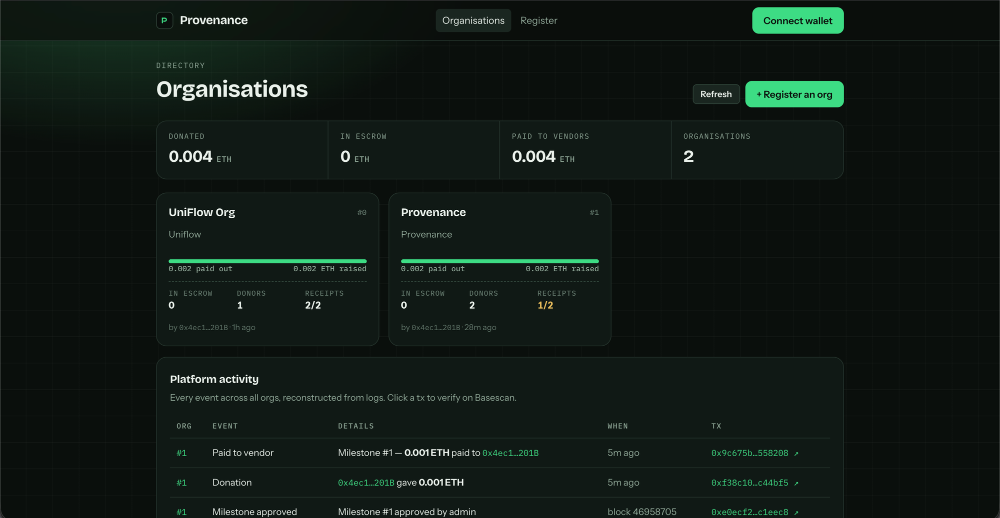
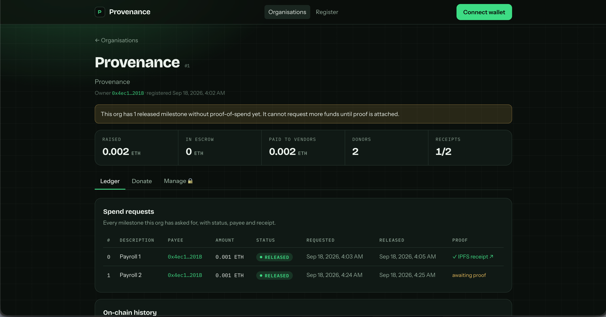

# Provenance — Transparent Donation Tracking (Hack2Ignite WB-05)

Multi-organisation on-chain donation + milestone-based fund release tracker. Any NGO registers an org; donors give ETH with a message; the org requests a spend milestone naming a vendor, the platform admin approves, funds go straight to the vendor, and the org must attach a receipt hash before it can ask for more. Every donation, milestone request, approval and release is an on-chain event on **Base Sepolia**, and the dashboard reads directly from the contract so nothing shown is "claimed" — it's all verifiable on Basescan.

## Screenshots

**Landing** — live receipt of the latest on-chain events, plus platform-wide totals.



**Organisations** — directory of every registered org with raised / escrow / paid-out figures, and a platform-wide activity feed rebuilt from contract logs.



**Org detail** — every spend request with status, payee and IPFS receipt; an org with a released milestone and no proof is blocked from requesting more.



## Repo layout

```
Provenance/
├── docs/        # 📖 START HERE — architecture, task split, build plan, demo script
├── contracts/   # Foundry — DonationPlatform.sol + tests + deploy script
├── frontend/    # Vite + React + TypeScript + wagmi/viem
└── backend/     # Express + TypeScript + Prisma/Postgres (indexer, metadata, IPFS receipts)
```

## Deployed contract

**Base Sepolia:** [`0xd38Fa0f8932025b5a8F996b5DE76e0a8480D5280`](https://sepolia.basescan.org/address/0xd38Fa0f8932025b5a8F996b5DE76e0a8480D5280) (verified) — full details in [`DEPLOYMENTS.md`](DEPLOYMENTS.md).

## Team

| Person | Owns |
|---|---|
| **Apurva** | Smart contract, deployment, all wallet/chain wiring in the frontend (core Web3) |
| **Aditya** | UI components & styling, backend API + Prisma, docs/demo, non-chain utilities |

See [`docs/05-TASK-SPLIT.md`](docs/05-TASK-SPLIT.md) for the exact task list.

## Quick start

```bash
# 1. Contracts
cd contracts && forge install && forge test

# 2. Frontend
cd frontend && pnpm install && cp .env.example .env && pnpm dev

# 3. Backend (optional for the demo)
cd backend && pnpm install && cp .env.example .env   # fill DATABASE_URL + PINATA_JWT
pnpm prisma:push && pnpm dev
```

Full setup instructions: [`docs/08-SETUP.md`](docs/08-SETUP.md)
